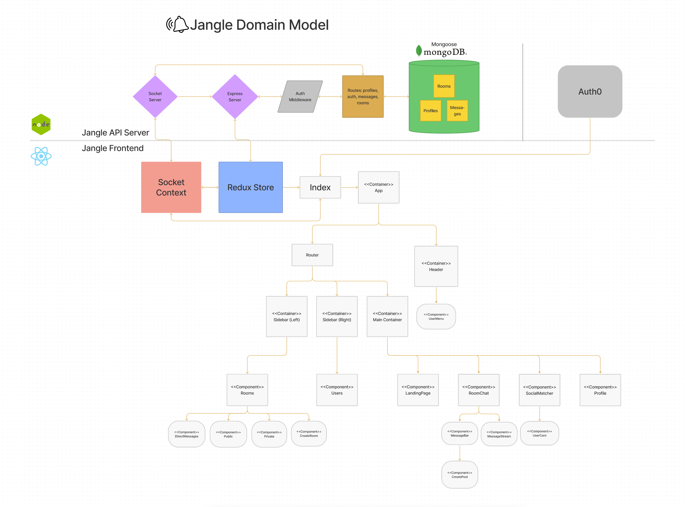

# Jangle API Server

- [Organization](https://github.com/jangle401)
- [Front End](https://github.com/jangle401/jangle-front)

## Team Members

- Alexander Beers : [LinkedIn](https://www.linkedin.com/in/alexander-r-beers/) / [GitHub](https://github.com/Beers15)
- Kason Braley : [LinkedIn](https://www.linkedin.com/in/kason-braley/) / [GitHub](https://github.com/KasonBraley)
- Ryan Emmans : [LinkedIn](https://www.linkedin.com/in/ryanemmans/) / [GitHub](https://github.com/ryanemmans)
- Stefanie Riehle : [LinkedIn](https://www.linkedin.com/in/stefanie-riehle/) / [GitHub](https://github.com/stefrie)

## Usage & Deployment

- Find our deployed app on [Heroku](https://jangle-app.herokuapp.com/).

## Dependencies

### Front End

|                   	|            	|                       	|
|-------------------	|------------	|-----------------------	|
| auth0             	| axios      	| emotion/react         	|
| material ui       	| node-sass  	| react testing library 	|
| redux             	| serve      	| socket.io             	|
| styled-components 	| sweetalert 	|                       	|

### Back End

|        	|            	|          	|
|--------	|------------	|----------	|
| bcrypt 	| cloudinary 	| cors     	|
| dotenv 	| express    	| mongoose 	|
| multer 	| socket.io  	|          	|

### Dev Dependencies

- electron
- eslint
- jest
- prettier

## Additional Tools and Technologies

|                 	|          	|                	|
|-----------------	|----------	|----------------	|
| React           	| MongoDB  	| Mongoose       	|
| Mongo Atlas     	| Heroku   	| Thunder Client 	|
| Npm             	| Invision 	| Figma FigJam   	|
| GitHub Projects 	| Discord  	| Electron       	|

## Domain Model

## Project Management

